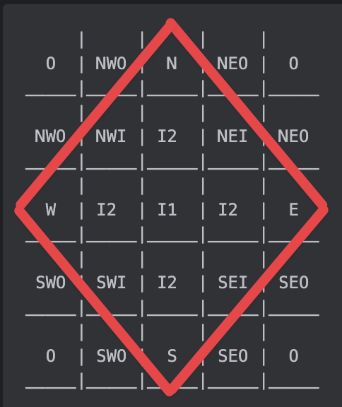

# Part 1

To keep things simple, we'll denote the start locations before a step as `S` and the end locations after a step as `E`.

From any start location, we can move in any of the cardinal directions (i.e. North, East, South, West) provided:

1. The resulting location is not a rock `#`
2. The resulting location is not already tagged as an end location `E`

The process of performing a "step" then amounts to:

```text
For each start location:
  For each of the adjacent locations in the four cardinal directions:
    Attempt to move to the adjacent location, and if it was possible append the location to a list of end locations
    
Swap the definition of start and end symbols
Reset the list of start locations to be the list of end locations
Clear the list of end locations
```

To get the reachable plot count after performing `N` steps, we simple need to count up all of the map cells that contain the start location symbol.

# Part 2

From visualising the step progress for our problem input it becomes clear that the reachable garden plots almost describe a diamond shape.
The number of reachable plots is equal to:

* The "area" of the diamond
* Minus the number of contained rocks
* Minus the number of non-reachable edge positions on the diamond perimeter
* Minus the number of currently unoccupied interior plots

However, the small input does not exhibit this behaviour, so I think we can assume that this particular observation is an artifact of our specific large problem input.
This is potentially something we can exploit!

Another interesting property of the large input is that there are _no rocks_ on the row and column that contain the start location.
This means that the size of the diamond will grow in breadth and height linearly for each step taken.
From the start location:

* It takes exactly 65 steps to reach the middle extremities of the starting map
* It take exactly 65 + 131 (map width) to get to the middle extremities of the next map

More generally, if we define an expansion factor N as the number of duplicate maps reachable from the start location (including diagonally) we can deduce that to get to the middle extremities of the duplicated map structure of size N it takes a total of `65 + N*131` steps.

We have been asked to evaluate the reachable plot count after `26501365` steps.

We have:

```text
26501365 = 65 + N * 131
```

Solving for `N` gives

```text
N = (26501365 - 65)/131
N = 202300
```

Since this divides _exactly_ then we know that the final points of the diamond shape will lie on the edge extremities of the duplicated map.

Our task now becomes:

1. What are the different types of duplicated maps after taking 26501365 steps
2. For each type of duplicated map we need to know how many of each there are, and how many reachable plots there are
3. We then need to sum up all of the reachable plots for the different types of duplicated map sections to determine the final answer

We can answer the first question by expanding the map with factor 2. 
We use 2 because N (202300) is even so our final solution will also represent an "even" state of the system.
This produces a map that conceptually can be represented as

```text
     |     |     |     |   
  O  | NWO |  N  | NEO |  O
_____|_____|_____|_____|_____
     |     |     |     | 
 NWO | NWI | I2  | NEI | NEO
_____|_____|_____|_____|_____
     |     |     |     | 
  W  | I2  | I1  | I2  |  E
_____|_____|_____|_____|_____
     |     |     |     | 
 SWO | SWI | I2  | SEI | SEO
_____|_____|_____|_____|_____
     |     |     |     |   
  O  | SWO |  S  | SEO |  O
_____|_____|_____|_____|_____
```
or with the diamond overlaid



Here we have:

* `O` contains no reachable plots
* `N`, `E`, `S` and `W` are the cardinal points of the diamond with a mix of reachable and unreachable plots
* `NWO` is mostly non-reachable plots except for the lower-right area
* `NEO` is mostly non-reachable plots except for the lower-left area
* `SWO` is mostly non-reachable plots except for the upper-right area
* `SEO` is mostly non-reachable plots except for the upper-left area
* `NWI` is mostly reachable plots except for the upper-left area
* `NEI` is mostly reachable plots except for the upper-right area
* `SWI` is mostly reachable plots except for the lower-left area
* `SEI` is mostly reachable plots except for the lower-right area
* `I1` is fully contained but will only have approximately half the reachable plots due to the parity switching with each step
* `I2` is fully contained but will only have approximately half the reachable plots due to the parity switching with each step (will be the opposite parity of `I1`)

For expansion factor 2 we have the the following numbers of plot types:

* 1 x each of `N`, `E`, `S` and `W`
* 4 x `I2`
* 1 x `I1`
* 2 x each of `NWO`, `NEO`, `SWO`, `SEO`
* 1 x each of `NWI`, `NEI`, `SWI`, `SEI`
* 4 x `O`

for a total of 25 duplicated map areas.

It is relatively easy to extrapolate this outwards. For example, for expansion factor 4 we have:

* 1 x each of `N`, `E`, `S` and `W`
* 16 x `I2`
* 9 x `I1`
* 4 x each of `NWO`, `NEO`, `SWO`, `SEO`
* 3 x each of `NWI`, `NEI`, `SWI`, `SEI`
* 24 x `O`

for a total of 81 duplicated map areas.

More generally, for expansion factor `N` (a positive multiple of 2) we have

* 1 x each of `N`, `E`, `S` and `W`
* N^2 x `I2`
* (N-1)^2 x `I1`
* N x each of `NWO`, `NEO`, `SWO`, `SEO`
* (N-1) x each of `NWI`, `NEI`, `SWI`, `SEI`
* 4 x [SUM(i) for i=1 to N-1] x `O`

for a total of 4 + N^2 + (N-1)^2 + 4*N + 4*(N-1) + 4*[SUM(i) for i=1 to N-1] == (2xN + 1)^2

Testing this out, when N = 2 we have 4 + 4 + 1 + 8 + 4 + 4 = 25 = 5^2

When N = 4 we have 4 + 16 + 9 + 16 + 12 + 4*6 = 81 = 9^2

When N = 6 we have 4 + 36 + 25 + 24 + 20 + 4*15 = 169 = 13^2


