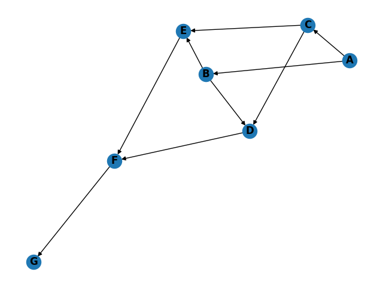

# Part 1

Bricks only fall downwards i.e. their z coordinates decrease from larger z values to smaller z values.

Bricks can't pass through the ground (z = 0) so the lowest possible z position for a brick is z = 1.

Bricks can't pass through each other, so once they are resting on another brick they will never move lower unless the brick underneath moves lower.

A nice data structure to model this is a directed, acyclic graph (DAG) where:

1. Each brick is a vertex in the graph
2. Edges indicate that two bricks are touching after coming to rest
3. The edge direction indicates the dependency i.e. an edge from B1 to B2 indicates that B1 is resting on B2

From the small problem input we have

```text
1,0,1~1,2,1   <- A
0,0,2~2,0,2   <- B
0,2,3~2,2,3   <- C
0,0,4~0,2,4   <- D
2,0,5~2,2,5   <- E
0,1,6~2,1,6   <- F
1,1,8~1,1,9   <- G
```

After settling the bricks we have

```text
Brick A is the only brick supporting bricks B and C.
Brick B is one of two bricks supporting brick D and brick E.
Brick C is the other brick supporting brick D and brick E.
Brick D supports brick F.
Brick E also supports brick F.
Brick F supports brick G.
Brick G isn't supporting any bricks.
```

As a directed graph, this looks like



In this simplified example, there is only one brick `A` touching the ground.
Essentially this is a foundational brick that can't be removed without causing movement above.

More generally, there wil be `N` foundational bricks for any finite set of bricks that have dropped.
Some of these will have bricks on top of them, and some may not have any bricks above them. 
If a foundational brick has nothing above it, it can be removed.

To determine which bricks can be safely removed, we need to know if an alternative path to a foundational brick exists for all bricks immediately above the current brick being removed.

Working through the simplified example:

* `A` can't be removed because the bricks immediately above it,`B` and `C`, have no alternative path to a foundational brick
* `B` can be removed because the bricks immediately above it, `D` and `E`, have alternative paths back to `A` via brick `C`
* `C` can be removed because the bricks immediately above it, `D` and `E`, have alternative paths back to `A` via brick `B`
* `D` can be removed because the brick immediately above it, `F`, has an alternative path back to `A` via brick `E`
* `E` can be removed because the brick immediately above it, `F`, has an alternative path back to `A` via brick `D`
* `F` can't be removed because the brick immediately above it, `G`, has no alternative path back to `A`
* `G` can be removed because it has no bricks immediately above it

An alternative way of phrasing this:

1. If the brick has nothing above it -> removable
2. Otherwise, for each brick immediately above:
   1. If the brick has more than one `in` edge -> removable
   2. Otherwise -> can't remove

To solve part 1, we need the following:

1. Representation of a brick, including its coordinates
2. Representation of all bricks frozen in time i.e. snapshot
3. A mechanism to "drop" the current snapshot down to the steady state
4. A mechanism to track brick dependencies i.e. a directed, acyclic graph
5. A mechanism to detect removable bricks

## Edge cases

There are some edge cases that we need to deal with here:

1. A brick might initially start off high up, but fall to the ground and have nothing above it
2. A brick might be completely surrounded by other bricks

# Part 2

We can use the same DAG from part 1 to assist with part2.

Essentially, for each brick:

1. If it has no successors (i.e. it's not supporting anything) then no brick will fall if it's removed
2. Otherwise, we need to find all of its successors in the graph and if they are only supported by the brick then they will fall when the brick is removed
